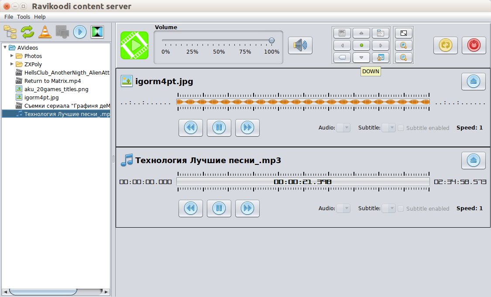
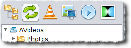
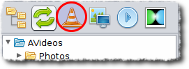

# Introduction

At home I use [Raspberry PI 3](https://www.raspberrypi.org/products/raspberry-pi-3-model-b/) (with installed [KODI media center](https://kodi.tv/)) to watch TV-shows and clips. There are number of browser plug-ins to open web links directly on KODI, but I need broadcast some media-content directly from my laptop. KODI supports sharing through Samba etc. but I am too lazy and like one-button solutions. So I decided to write a small easy utility. I have been programming in Java since 1999 and Java was chosen as development platform, also it was interesting for me to try Java Swing GUI together with Spring Boot.   

# How to load and start?

## If you don't have installed Java or don't care about that

It is a Java application so that in ideal it needs pre-installed Java 1.8+, but since 1.1.0 release Iprovide also pre-built versions with embedded JDK images, they can be started without installed Java:
 - [version for Linux with JDK image](https://github.com/raydac/ravikoodi-server/releases/download/1.1.1/ravikoodi-server-1.1.1-linux-withjdk.tar.gz)
 - [version for Windows with JDK image](https://github.com/raydac/kodi-videoserver-app/releases/download/1.1.1/ravikoodi-server-1.1.1-windows-withjdk.zip)
 - [version for MacOS with JDK image](https://github.com/raydac/kodi-videoserver-app/releases/download/1.1.1/ravikoodi-server-1.1.1-macos-withjdk.zip)

You can just load needed archive, unpack in a folder and start its executable file.

## If you have installed Java and need less size distributives

If you have pre-installed Java 1.8+, you can load files without embedded JDK:
 - [version for Linux](https://github.com/raydac/ravikoodi-server/releases/download/1.1.1/kodi-video-1.1.1.sh)
 - [version for Windows](https://github.com/raydac/ravikoodi-server/releases/download/1.1.1/kodi-video-1.1.1.exe)
 - [version for MacOS](https://github.com/raydac/ravikoodi-server/releases/download/1.1.1/kodi-video-1.1.1_OSX.dmg)

## Requirements

To be working well, the application requires:
 - max 100 Mb on hard-disk
 - more or less powerful computer (especially for high bitrate screencasting)
 - pre-installed [Java 1.8+](https://bell-sw.com/) for versions without embedded JDK image
 - pre-installed [FFmpeg](https://www.ffmpeg.org/) for screencasting

   

# Application

## Some technical details
It is a Spring Boot based application with embedded Jetty web server. For screencast it starts external FFmpeg application and communicate with it through loopback TCP ports. Start of application takes 5-10 seconds and just after start it eats about 300-700 Mb of RAM. For screencasting it makes screenshots so that be carefult in use on weak computers.   

## How to build?
It is absolutely free and open-source application (under Apache 2.0 license), I don't ask for any fee for use of it (but you could make some donation and I would be very appreciate for that).
1. For build distributived you need JDK 1.8 (you can use JDK 9+ but some release plug-ins of Maven can work only with JDK 1.8)
2. You need Maven to build project
3. Go to into project folder and call `mvn clean install` to get compiled JAR, it can be started separately through `java -jar <JAR_FILE>`
4. To get release versions, you should use `mvn clean install -Ppublish`, in the `target` folder you will find all prepared archives
5. To get SH version for Linux, you should use `mvn clean install -Ppublishsh`, in the `target` folder you will find SH version of the application

## Tune KODI
Select network settings ofyour KODI player (its appearance depends on version)   
   
Enable __Allow remote control via HTTP__, select address, port and access credentials.

## Tune application server

Open options panel `Tools -> Options`.   

1. In __Web server__ select in __Host__ your computer's network interface (which is visible for KODI)
2. In __Web server__ select any free port on your computer in __Port__ (it is better use port number bigger than 1024)
3. In __Kodi__ enter network address of your KODI machine in __Address__ and KODI listening port in __Port__
4. If you use any password protection for access to your KODI, enter needed credentials into __Name__ and __Password__

After listed steps, your local video server is prepared for broadcasting to KODI.

# Play content
1. Press __File tree__ icon in the button tool bar and select folder contains media-contend through File dialog.

2. Select needed content in the file tree   

3. If you want open the selected media file in the default system player, then click twice the media file or press button

4. Press button `Play selected item on KODI` to send the media file to internal server and start broadcasting to KODI.

5. If you have tuned screencast options (and you have provided FFmpeg) then you can start screencast
  
