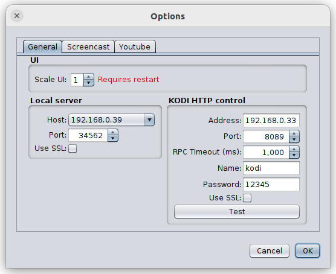
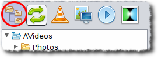
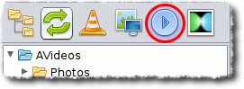
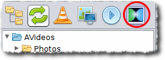

# Changelog

- __1.1.11 (25-oct-2023)__
  - minor fixes
  - added direct URL link open mode for Youtube links
  - updated embedded JDK to 21.0.1+12
  - updated Spring Boot to 3.1.5

- __1.1.10 (05-jan-2023)__
  - minor fixes
  - added AppImage version
  - windows launcher moved from i386 to amd64
  - updated embedded JDK to 19.0.1+11
  - updated Spring Boot to 3.0.1

[Full changelog](changelog.txt)

# Introduction

At home I use [Raspberry PI 3](https://www.raspberrypi.org/products/raspberry-pi-3-model-b/) (with installed [KODI media center](https://kodi.tv/)) to watch TV-shows and clips. There are number of browser plug-ins to open web links directly on KODI, but I need broadcast some media-content directly from my laptop. KODI supports sharing through Samba etc. but I am too lazy and like one-button solutions. So I decided to write a small easy utility to provide needed one-button way.

# How to load and start?

## Pre-built versions

| OS                                           |  Download link                                                                                                                                                                                | 
| -------------------------------------------- | --------------------------------------------------------------------------------------------------------------------------------------------------------------------------------------------- |
|         | __[Application for Windows amd64 (JRE included)](https://github.com/raydac/ravikoodi-server/releases/download/1.1.11/ravikoodi-app-1.1.11-windows-jdk-amd64.zip)__           |
|           | __[Application for OSX amd64 (JRE included)](https://github.com/raydac/ravikoodi-server/releases/download/1.1.11/ravikoodi-app-1.1.11-macos-jdk-amd64.zip)__                 |
|  | __[Application for OSX aarch64 (JRE included)](https://github.com/raydac/ravikoodi-server/releases/download/1.1.11/ravikoodi-app-1.1.11-macos-jdk-aarch64.zip)__             |
|         | __[Application TAR.GZ for Linux amd64 (JRE included)](https://github.com/raydac/ravikoodi-server/releases/download/1.1.11/ravikoodi-app-1.1.11-linux-jdk-amd64.tar.gz)__     |
|      | __[Application AppImage for Linux amd64 (JRE included)](https://github.com/raydac/ravikoodi-server/releases/download/1.1.11/ravikoodi-app-1.1.11-x86_64.AppImage)__          |
|           | __[Application, cross-platform JAR file](https://github.com/raydac/ravikoodi-server/releases/download/1.1.11/ravikoodi-app-1.1.11.jar)__                                     | 

You can just load needed archive, unpack in a folder and start its executable file.

## Requirements

To be working well, the application requires:
 - min 100 Mb on hard-disk
 - more or less powerful computer (especially for high bitrate screencasting)
 - pre-installed [Java 17+](https://bell-sw.com/pages/downloads/) for versions without embedded JDK image
 - pre-installed [FFmpeg](https://www.ffmpeg.org/) for screencasting

   

# Application

## Some technical details
It is a Spring Boot based application with embedded Jetty web server. For screencast it starts external FFmpeg application and communicate with it through loopback TCP ports. Start of application takes 5-10 seconds and just after start it eats about 300-700 Mb of RAM. For screencasting it makes screenshots so that be carefult in use on weak computers.   

## How to build?
It is absolutely free and open-source application (under Apache 2.0 license), I don't ask for any fee for use of it (but you could make some donation and I would be very appreciate for that).
1. You need Maven to build project
2. Go to into project folder and call `mvn clean install` to get compiled JAR, it can be started separately through `java -jar <JAR_FILE>`
3. To get release versions, you should use `mvn clean install -Ppublish`, in the `target` folder you will find all prepared archives
4. To get SH version for Linux, you should use `mvn clean install -Ppublishsh`, in the `target` folder you will find SH version of the application

## Tune KODI
Select network settings ofyour KODI player (its appearance depends on version)   
   
Enable __Allow remote control via HTTP__, select address, port and access credentials.

## Processing of Youtube links
There are several ways to open Youtube links.
1. Just drag and drop a youtube link from browser to the application window.
2. Open link through menu __File->Open Youtube__

By default the aplication uses KODI Youtube plugin to open links but since 1.1.11 provided way to open Youtube links as direct URLs. The way can not be recognized as very stable because Youtube can change its API. To activate it, you should select it in __Options__ dialog.   

## Tune application server

Open options panel `Tools -> Options`.   

1. In __Web server__ select in __Host__ your computer's network interface (which is visible for KODI)
2. In __Web server__ select any free port on your computer in __Port__ (it is better use port number bigger than 1024)
3. In __Kodi__ enter network address of your KODI machine in __Address__ and KODI listening port in __Port__
4. If you use any password protection for access to your KODI, enter needed credentials into __Name__ and __Password__

After listed steps, your local video server is prepared for broadcasting to KODI.

# Play content
1. Press __File tree__ icon in the button tool bar and select folder contains media-contend through File dialog.   

2. Select needed content in the file tree   

3. If you want open the selected media file in the default system player, then click twice the media file or press button   

4. Press button `Play selected item on KODI` to send the media file to internal server and start broadcasting to KODI.   

5. If you have tuned screencast options (and you have provided FFmpeg) then you can start screencast   
  
